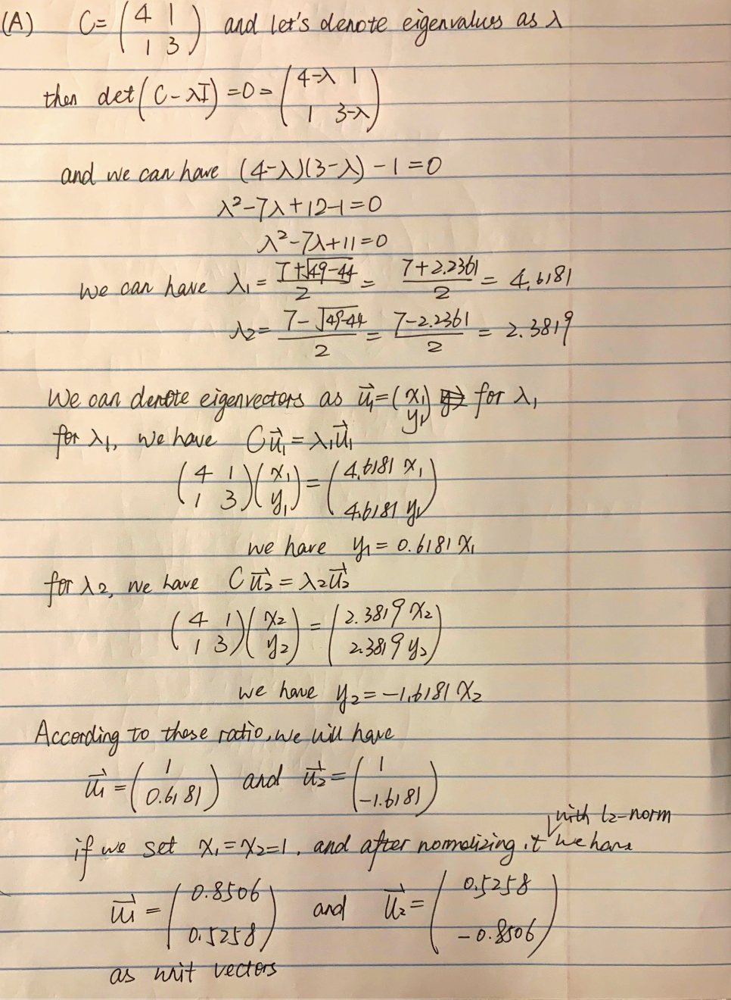
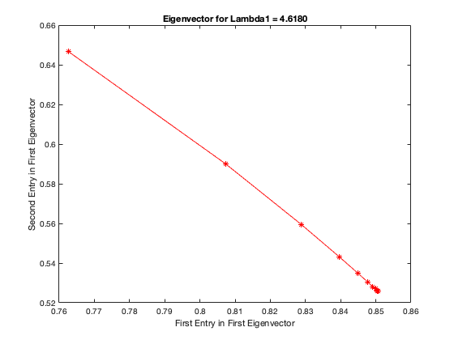
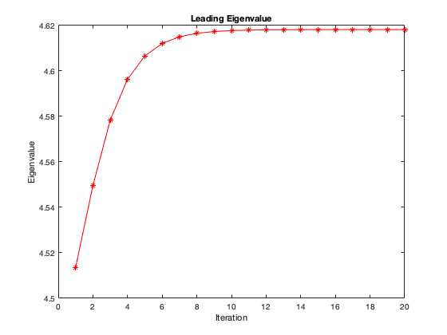

# BSS Lecture Codes
## Reza Sameni
## Emory University Department of Biomedical Informatics

A short lecture of blind-source separation algorithms with practical examples in Matlab


### Student Name: Wenjing Ma
### Student Email: wenjing.ma@emory.edu

***

### Question 1
#### Part A

Please find the screenshot below. 



#### Part B

I used `eig` function in Matlab to calculate the eigenvalues and eigenvectors. 

```matlab
C = [4 1; 1 3];
[V, D] = eig(C, "vector")
```

I have eigenvalues as 

```
D =

    2.3820
    4.6180
```

and the corresponding eigenvectors as:

```
V =

    0.5257   -0.8507
   -0.8507   -0.5257
```

I eigenvalues are the same and the eigenvectors have also been normalized into unit vectors however the sign are different. According to the definition `Au = \lambda u`, we know that by changing the sign of `u` on both sides will not change the result. Thus we know that the results calculated by hand and the Matlab function are the same.

***

### Question 2

#### Part A

The eigenvalues calculated by the Power Method is as below, which is the same as using the `eig` function and by hand.

```
lambda1 =

    4.6180


lambda2 =

    2.3820
```

#### Part B

The code is written in `plotPowerMethod.m`.

The plot for two entries in the principal vector in the first 20 interations and we can observe that it converges to a point which is [0.8507 0.5257].



The plot for the leading eigenvalue int the first 20 iterations and it also converges to 4.6180.



***

### Question 3

#### Part A

I selected the EEG signals for Ex01 to Ex04. The EEG signals contain 26 channels in total. 

#### Part B

- `Ex01_testPCA.m` This script functions to do principle component analysis (PCA) on the EEG signals. The script first shifted the data in each channel with mean as 0 and computed the covariance matrix for the 26 channels which resulted in a 26*26 matrix. Then the script applied Eigenvalue Decomposition method on the covariance matrix and extracted out 26 eigenvalues in an ascending order. By cumulatively summing up the eigenvalues, if we set a 99% as the cut-off threshold, only 8 PCs will be selected to approximate the original signal. Although in some channels, it does not loose much information, however, the compressed data of ECG signal (channel 26) almost lost all the peaks and information. Thus, PCA is not sufficient for analyzing this kind of data.
- `Ex02_testEigenAnalysisPowerMethod.m`This script computes the Eigenvalue and Eigenvectors of a matrix in an iterative way named Power method. We know that originally, eigenvalues computation is similar to solving a polynomial equation in which the high-order term can be the size of matrix. Thus, this can be difficult and time-consuming. However, most applications only focus on the dominant eigenvalue which generates the principle vector which points to the maximum variability of the data. 
- `Ex03_testICAmethods.m`This scripts encompasses three different algorithms for blind source separation: Hyvarinen's fixed point (fastICA), Infomax and Joint Approximation Diagonalization of Eigenmatrices (JADE) and Second Order Blind Identification (SOBI). These methods aim to seperate the independent components from the signals. All methods need whitening step which first applies PCA to decorrelate the data and then by Shphering to whiten the data. In the script, we seleted until the last eigenvalues to preserve all information. For ICA, we need to select a non-linear function to mimic the nature distribution. SOBI used a second order statistics to remove the correlation. Because EEG datasets is very noisy, thus we selected to choose the number of correlation matrices as 100 according to suggestion. JADE is similar to SOBI but it performs on n(n+1)/2 eigenmatrices.
- `Ex04_testEOGArtifactRemoval.m`The script aims to remove artifact from the EOG signal because it contaminated the EEG trace. We originally know that channel 23, 24 and 25 are EOG signals. We first applied JADE to separate the independent source from 26 channels and then according to the visualization, selected the independent components which should be EOG artifacts with prior knowledge. Compared with NSCA method, we can clearly see that the first channel is an artifact and those atifact components are then set to 0. After plotting out the original signal, JADE denoised signal and NSCA denoised signal, we could see that in certain channels, there eixsts a huge impact caused by the EOG artifacts. However, although the artifacts get removed, the real signal still exists for channel 26. 
- `Ex05_testFetalECGExtraction.m` The script contains five demos and `testPCAICAPiCAfECGExtraction` first loaded the Fetal ECG data and removed the baseline wander. Then it did several methods stated above such as PCA, fastICA, JADE, SOBI on the signals to seperate out independent components. The  maternal peaks are calculated and then fed as input to the PiCA algorithm, then similarly, the fetal peaks detected by JADE are also fed to PiCA algorithm to calculate the real signals. From the eigenvalue decomposition, we can observe a huge decrease in the eigenvalues and the PCA result shows a blurry pattern on the source separation result. However, fastICA, JADE and SOBI have a much clearer pattern in detecting the real maternal and fetal peaks. Although with certain order differences, the separation result looks similar. Then based on PiCA, we could observe when based on maternal-based results, the maternal signal appears at the top of the signal and in the meantime for fetal-based results, the fetal signal appears top. Thus, by using the PiCA method with certain objective peaks as input, we could easily separate the wanted information in the top list of signals.

***

### Question 4

#### Part A

This paper introduces a fast method, SL0, to seperate the sparse resources from an underdetermined system. Although traditional method turned the seperation into using the l1 norm which penalized the coefficients to achieve the result, the overall speed using LP solver is very slow. To speed up, previous work proposed iterative re-weighted lease squares (IRLS), matching pursuit (MP) but will deteriorate the accuracy.  Thus, to speed up the algorithm without compromising the accuracy, the author propsed the SL0 which aims to minimize the l0 norm (the number of non-zero in the data) which is the same as minimizing l1 norm when the system is very large.  

The author first converted the discrete l0 norm of the data into an approximated continous distribution and then try to minimize the difference between the original distribution and target distribution. Then, the author converted the problem from minimizing the l0 norm of the data into maximizing the approximation with small value parameters. However, there exists a dilemma that when the parameter gets larger, the approximation could be smoother but the approximation gets worse. Thus, the author applied a similar idea as "grid search" to find the most appropriate parameters by searching in a descending way.

By validating the theoretical part, the author utilizes mathematical lemmas to prove the existence of convergence and the correctness in converting the problem to minimize l2 norm. In practice, the data could be very tricky and the author validates his algorithm from multiple perspectives including the noise ratio, the degree of sparsity, the size of the data, dependence of the source, etc. The evaluation metrics for the quality is measured by signal-to-noise ratio (SNR) and mean-square error (MSE) which can calculate the distance between the actual source and the approximated source. We could clearly tell that when the parameter decreases, the approximation is more accurate. Another measurement is the speed because the traditional methods take long time to achieve the result, while the author compares to LP and FOCUSS which proves that SL0 largely speeds up the computation. With a thorough comparison, SL0 proves to be robust to noise and can be very fast to seperate the sparse resources. However, for an optimization problem, how to theoratically prove that the algorithm could avoid local minima and how to select parameters are always general questions to answer.

The pseudo-code for SL0 can be summarized as below:

```matlab
pseudoA = pinv(A);  % calculate pseudo-inverse
s0Hat = pseudoA * x;  % calculate the minimum l2 norm
c = 0.5;   % decreasing factor
sigmaList = Inf([1 N]);  % final answer
sigmaList(1) = 4*max_i|s_i| % initialzte sigma1
for i in 2:J
    sigmaList(i) =  sigmaList(i-1)*c;  % decreasing sigma
end

mu = 0.001 % small positive constant
for i in 1:J
    % iterate each sigma
    sigma = sigmaList(i);    
    % maximize the function
    s = s0Hat(i-1); 
    for l in 1:iter
        delta = [s1*exp(-s1^2/(2*sigma^2)) s2*exp(-s2^2/(2*sigma^2)) ...]';
        s = s - mu*delta; 
        s = s - A'*inv(A*A')*(A*s-x);
    end
    % update the sigmalist
    sigmaList(i) = s;
end
```


